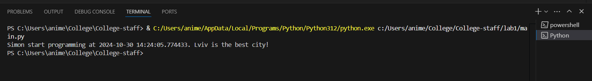

# Звіт до роботи 1
## Тема: оформлення робіт та перша програма
### Мета роботи: налаштувати середовище, створити репозиторій, попрацювати з Markdown та оформити звіт.

---
## Виконання роботи
* ### Результати виконання завдань:
    1. Створив репозиторій, [оформив його](https://github.com/SimonCherkas/College-staff).
    1. Навчився працювати з репозиторієм та налаштував інтеграцію з Visual Studio Code;
    1. Написав [першу програму Python та запустив її](./main.py). Програма вивела текст представлений на скріншоті:
    

    1. Написав [другу та третю програму Python та запустив її](./main.ipynb). Друга програма вивела текст представлений на скріншоті:
    

( ͡° ͜ʖ ͡°)  👻

---

## Висновок:

- Отже, у цій роботі було створено та оформлено репозиторій. Також ознайомився із форматуванням Markdown. 
- Було досягнуто мету роботи: налаштувати середовище, створити репозиторій, попрацювати з Markdown та оформити звіт.
- Отримано нові знання: як працювати з Github, форматуванням Markdown та як створювати та зручно оформлювати репозиторій. 
- Всі завдання виконано, проблем та труднощів це не викликало.

---
⠀⠀⠀⠀